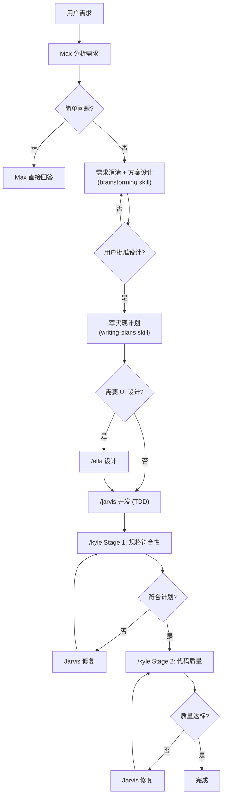
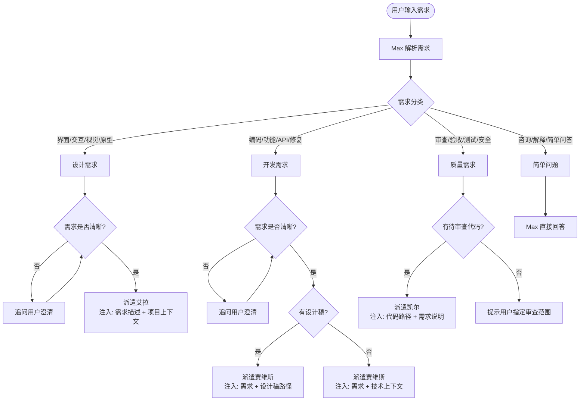
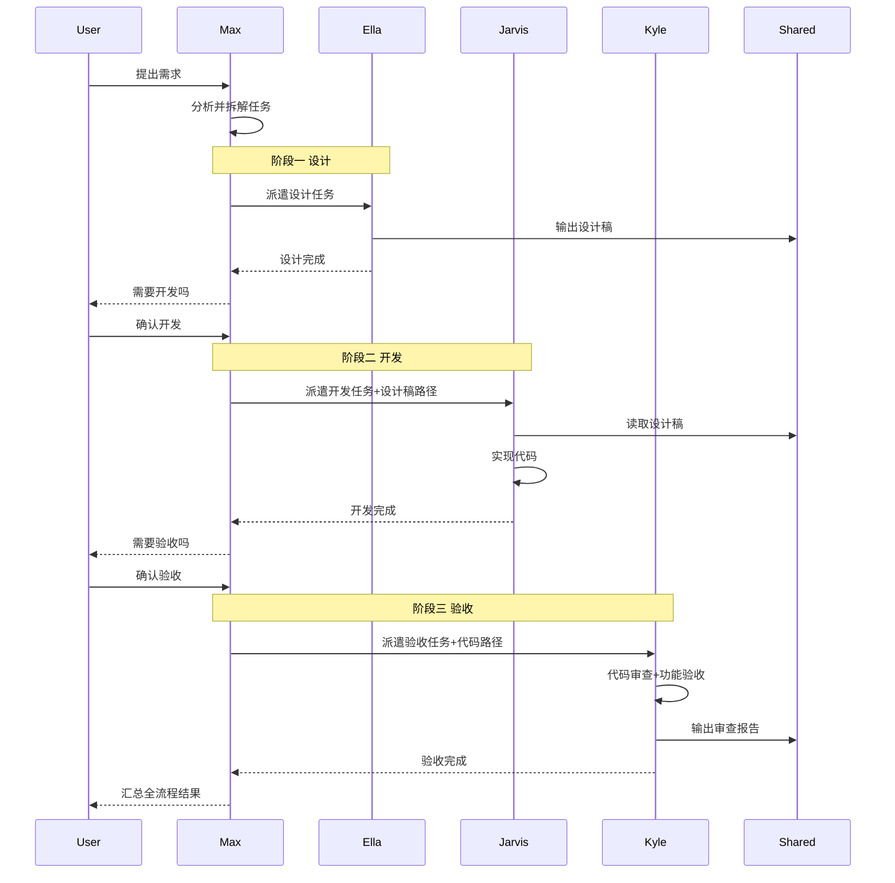
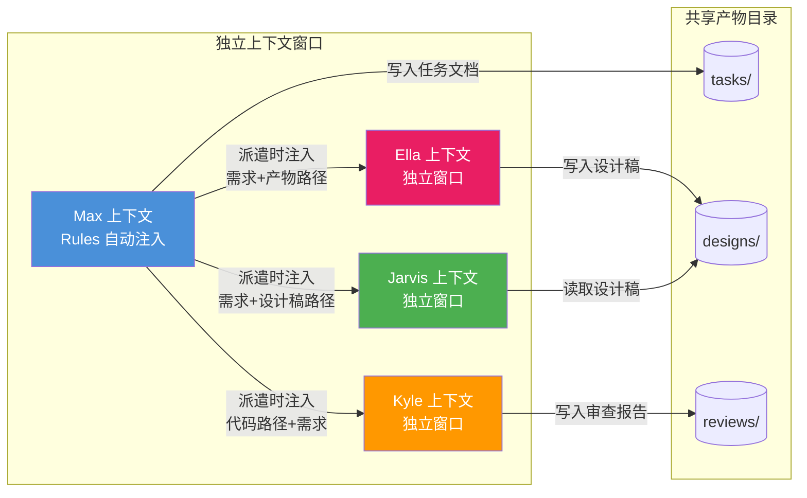
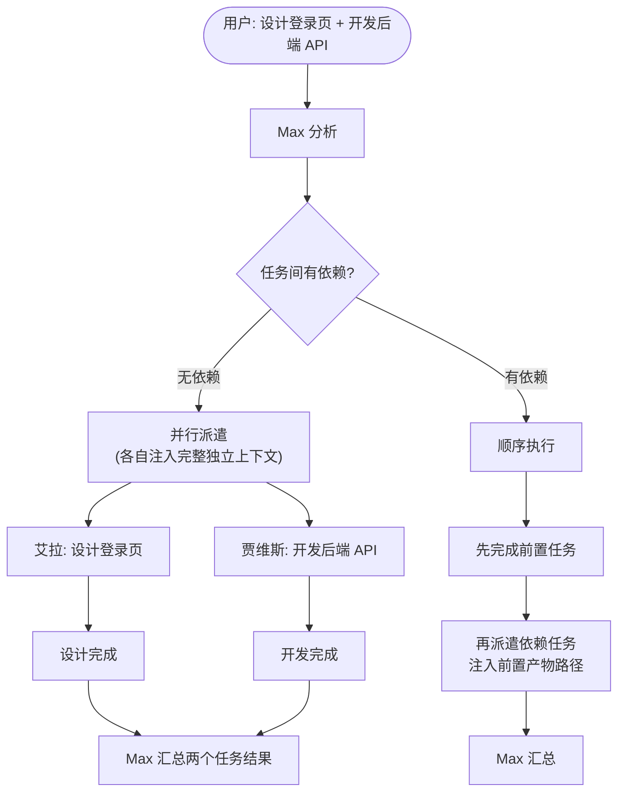
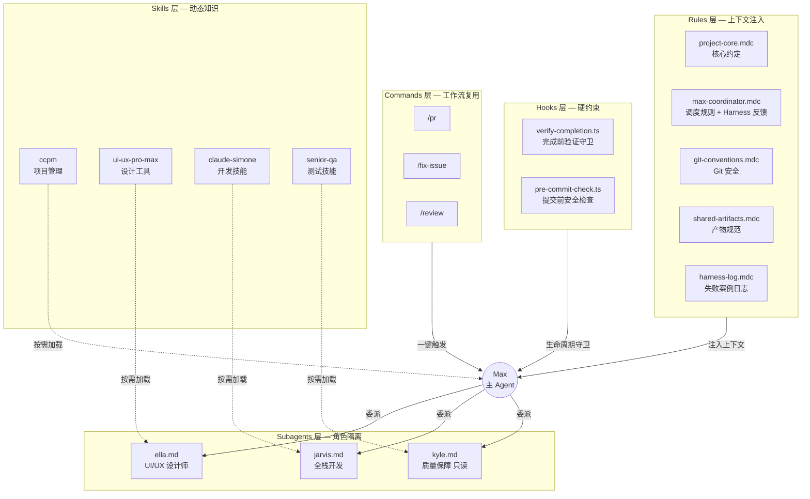

# aiGroup - AI 团队协作框架（Cursor 版）

> 单入口 AI 团队：在 Cursor IDE 中自动派遣设计、开发、测试专家协作完成任务

## 快速开始

1. 用 Cursor 打开本项目
2. 直接在 Cursor 的 Agent 模式中输入需求

就这样。麦克斯 (Max) 会自动就位，根据你的需求派遣对应的团队成员。

> 本分支为 **Cursor IDE 专用**，通过 `.cursor/rules/`（规则）+ `.cursor/agents/`（子 Agent）+ `.cursor/skills/`（技能）驱动多 Agent 协作。如需 Claude Code（CLI）版本，请切换到 `master` 分支。

## 团队成员

| 成员 | 角色 | 负责什么 | 不负责什么 |
|------|------|----------|-----------|
| 麦克斯 (Max) | 项目经理 | 需求分析、任务拆解、进度协调 | 写代码、做设计、做测试 |
| 艾拉 (Ella) | UI/UX 设计师 | 界面设计、交互原型、设计规范 | 写代码、做测试 |
| 贾维斯 (Jarvis) | 全栈开发 | 前后端编码、API、技术方案 | 做设计、做测试验收 |
| 凯尔 (Kyle) | 质量保障 | 代码审查、功能验收、安全审计 | 写代码、做设计 |

## 工作流程

### 强制工作流管道

非简单需求必须经过完整管道，不可跳过或合并环节：

```
需求澄清 → 方案设计 → 用户批准 → 实现计划 → 开发(TDD) → 两阶段审查 → 完成
```



### 三条铁律

| 铁律 | 说明 |
|------|------|
| 证据优于断言 | 任何完成声明必须附带验证证据，禁止"应该没问题" |
| 流程不可跳过 | 工作流管道的每个环节必须走完 |
| 不确定时先问 | 宁可多问一句，不要假设 |

### 任务派遣决策流程



### 完整流水线（设计 → 开发 → 验收）



### 上下文传递机制



> **关键规则**：子 Agent 之间不能直接通信，所有上下文由 Max 在派遣时注入，跨 Agent 协作通过 `.dev-agents/shared/` 目录下的文件实现。

### 并行执行场景



### Cursor 五层 Harness 架构与 Agent 关系



## 使用示例

```
你: 帮我设计一个登录页面
Max: [分析需求，派遣艾拉] → 艾拉输出设计稿 → .dev-agents/shared/designs/

你: 根据设计稿开发登录功能
Max: [派遣贾维斯，注入设计稿路径] → 贾维斯实现代码

你: 验收一下登录功能
Max: [派遣凯尔，注入代码路径 + 需求] → 凯尔输出审查报告 → .dev-agents/shared/reviews/

你: /pr
Agent: [自动执行] git diff → 撰写 commit message → 推送 → 创建 PR → 返回链接

你: /fix-issue 42
Agent: [自动执行] 获取 Issue 详情 → 定位代码 → TDD 修复 → 验证 → 询问是否创建 PR
```

## 项目结构

```
ai-agent-workflowGroup/
├── .cursor/
│   ├── rules/                     # Rules — 主 Agent (Max) 的行为规则
│   │   ├── project-core.mdc       #   始终生效：核心约定（中文注释、编码规范）
│   │   ├── max-coordinator.mdc    #   始终生效：Max 角色 + 团队调度 + Harness 反馈循环
│   │   ├── git-conventions.mdc    #   始终生效：Git 安全与提交格式
│   │   ├── shared-artifacts.mdc   #   共享目录触发：产物规范
│   │   └── harness-log.mdc        #   Harness 失败案例日志（活文档）
│   ├── agents/                    # Subagents — 可委派的子 Agent
│   │   ├── ella.md                #   艾拉：UI/UX 设计师
│   │   ├── jarvis.md              #   贾维斯：全栈开发工程师
│   │   └── kyle.md                #   凯尔：质量保证工程师（只读模式）
│   ├── hooks/                     # Hooks — Agent 生命周期硬约束
│   │   ├── verify-completion.ts   #   stop hook：完成前验证守卫
│   │   └── pre-commit-check.ts    #   stop hook：提交前安全检查
│   ├── hooks.json                 # Hooks 配置入口
│   ├── commands/                  # Commands — 可复用的工作流命令
│   │   ├── pr.md                  #   /pr：提交并创建 Pull Request
│   │   ├── fix-issue.md           #   /fix-issue：从 Issue 出发修复
│   │   └── review.md              #   /review：代码审查
│   └── skills/                    # Skills — 技能资源（Cursor 自动发现）
│       ├── brainstorming/         #   工作流：需求澄清与方案设计
│       ├── writing-plans/         #   工作流：实现计划编写
│       ├── systematic-debugging/  #   工作流：系统化调试
│       ├── verification-before-completion/ # 工作流：完成前验证
│       ├── ui-ux-pro-max/         #   UI/UX 设计工具（艾拉）
│       ├── senior-frontend/       #   前端开发（艾拉/贾维斯）
│       ├── claude-simone/         #   开发框架（贾维斯）
│       ├── senior-backend/        #   后端开发（贾维斯）
│       ├── senior-qa/             #   QA 测试（凯尔）
│       ├── ccpm/                  #   项目管理（麦克斯）
│       ├── skills-manifest.json   #   技能来源清单（版本追踪）
│       └── ...                    #   更多专业技能（共 27 个）
├── .dev-agents/
│   └── shared/                    # Agent 协作产物
│       ├── tasks/                 #   任务文档
│       ├── designs/               #   设计稿
│       ├── reviews/               #   审查报告
│       └── templates/             #   文档模板
├── scripts/
│   ├── update-skills.ps1          # Skills 更新脚本（Windows）
│   ├── update-skills.sh           # Skills 更新脚本（Linux/Mac）
│   ├── check-gitignore.sh         # .gitignore 检查脚本
│   └── clean-system-files.sh      # 系统文件清理脚本
└── README.md
```

### Cursor 五层 Harness 架构

本项目遵循 [Cursor 官方规范](https://cursor.com/docs) 与 [Harness Engineering](https://martinfowler.com/articles/harness-engineering.html) 范式，通过五层机制实现多 Agent 可靠协作：

| 层级 | 位置 | 作用 | 详情 |
|------|------|------|------|
| **Rules** | `.cursor/rules/` | 注入主 Agent 上下文 | Max 角色、项目约定、Git 规范、Harness 日志始终生效 |
| **Subagents** | `.cursor/agents/` | 独立子 Agent，被 Max 委派 | 艾拉/贾维斯/凯尔各自有独立上下文窗口 |
| **Hooks** | `.cursor/hooks/` | 硬约束 — Agent 生命周期守卫 | 完成前验证、提交前安全检查，系统强制执行 |
| **Commands** | `.cursor/commands/` | 可复用的工作流命令 | `/pr`、`/fix-issue`、`/review` 一键触发 |
| **Skills** | `.cursor/skills/` | 可复用的专业知识包 | 27 个技能包，Cursor 自动发现并按需加载 |

### 子 Agent 调用方式

| 子 Agent | 显式调用 | 自动委派 | 模式 |
|----------|---------|---------|------|
| 艾拉 (Ella) | `/ella` | 涉及设计需求时 Max 自动委派 | 默认（可读写） |
| 贾维斯 (Jarvis) | `/jarvis` | 涉及开发需求时 Max 自动委派 | 默认（可读写） |
| 凯尔 (Kyle) | `/kyle` | 涉及审查/测试需求时 Max 自动委派 | 只读（readonly） |

## 技能来源与更新

| 技能 | 来源 | 许可证 | 更新方式 |
|------|------|--------|---------|
| CCPM 项目管理 | [automazeio/ccpm](https://github.com/automazeio/ccpm) | MIT | 脚本自动 |
| PM Claude Skills | [mohitagw15856/pm-claude-skills](https://github.com/mohitagw15856/pm-claude-skills) | MIT | 脚本自动 |
| Claude Simone | [Helmi/claude-simone](https://github.com/Helmi/claude-simone) | 见原仓库 | 脚本自动 |
| Engineering Team (15个) | [alirezarezvani/claude-skills](https://github.com/alirezarezvani/claude-skills) | 见原仓库 | 脚本自动 |
| UI/UX Pro Max | SkillsMP 技能市场 | MIT | 手动下载 |
| Senior Frontend | SkillsMP 技能市场 | MIT | 手动下载 |
| Senior QA / TDD | SkillsMP 技能市场 | MIT | 手动下载 |

### 更新 Skills

```powershell
# Windows — 更新所有 GitHub 来源的 skill
.\scripts\update-skills.ps1 -Target all

# 只更新某个来源
.\scripts\update-skills.ps1 -Target ccpm
.\scripts\update-skills.ps1 -Target simone
.\scripts\update-skills.ps1 -Target engineering

# 查看需要手动更新的 skill
.\scripts\update-skills.ps1 -Target manual
```

```bash
# Linux/Mac
bash scripts/update-skills.sh all
```

技能来源和版本信息记录在 `.cursor/skills/skills-manifest.json` 中。

## 致谢

本项目的工作流驱动理念、铁律机制和质量门禁设计受到 [Superpowers](https://github.com/obra/superpowers) 项目的启发。Superpowers 是一个优秀的 agentic 开发方法论框架，aiGroup 在保留自身角色体系的基础上融合了其核心思想。

## 许可证

MIT License
