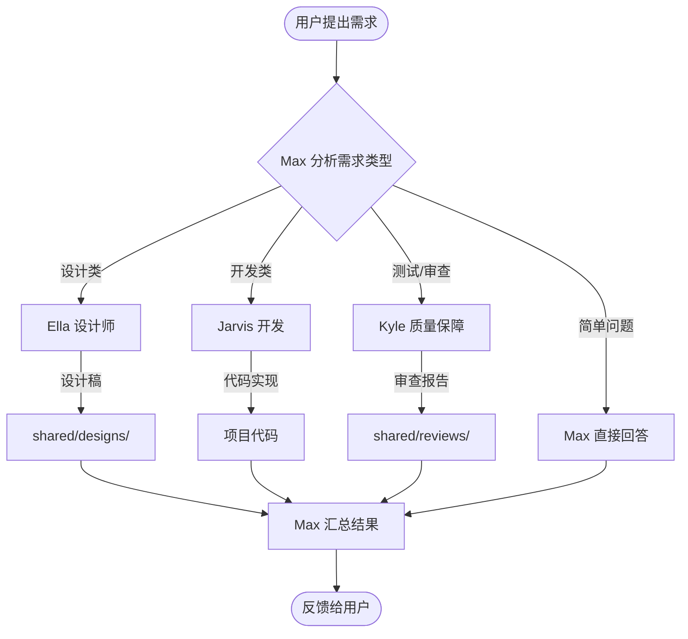
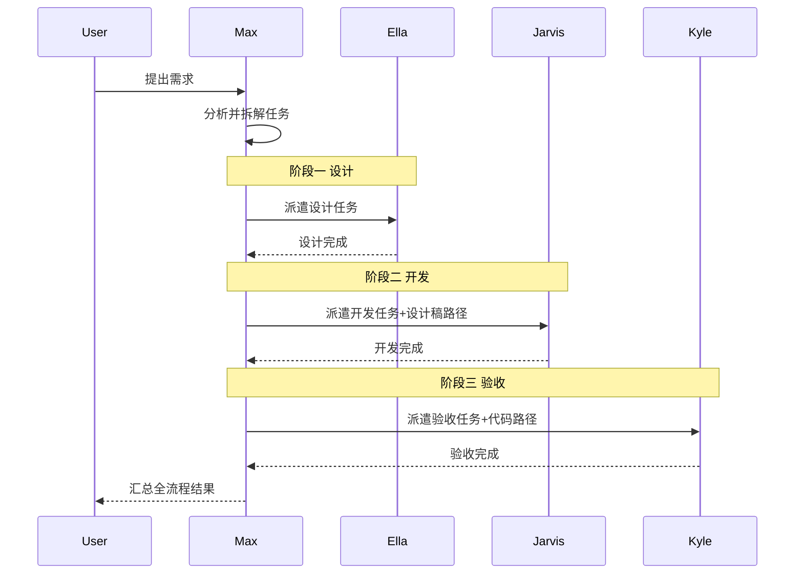
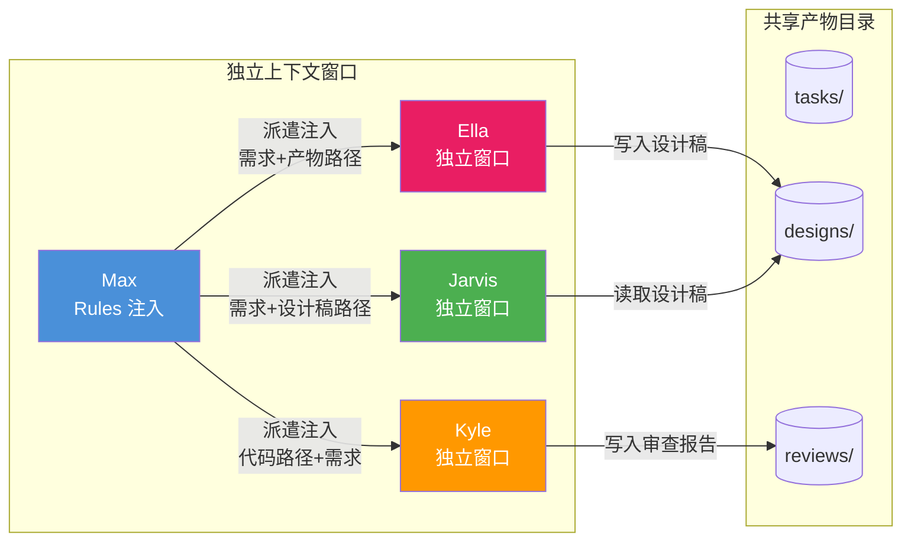
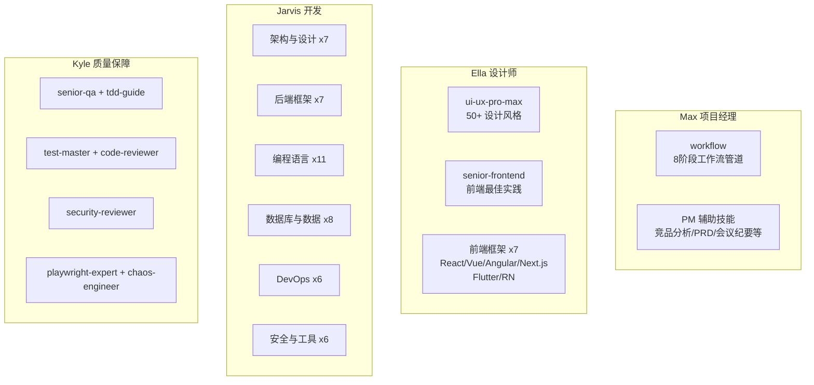

# aiGroup - AI 团队协作框架

[](https://npmjs.com/package/aigroup-workflow)
[](LICENSE)
[](https://claude.ai/code)

> 单入口 AI 团队：一个命令启动，按需自动派遣设计、开发、测试专家。
> 内置门禁式工作流：需求澄清 → 方案设计 → 实现计划 → 子代理开发 → 两阶段审查 → 分支收尾。

## 快速开始

### 环境要求

| 依赖 | 最低版本 | 用途 |
|------|---------|------|
| [Claude Code](https://docs.anthropic.com/en/docs/claude-code) | 最新版 | AI Agent 运行时（推荐） |
| [Cursor](https://cursor.com) | 最新版 | AI IDE（可选） |
| Node.js | 18+ | CLI 工具 |
| Git | 2.x | 版本控制 |
| Bash | 4.x+ | Harness 传感器（Windows 用 Git Bash） |

### 安装

```bash
# 方式一：全局安装（推荐，安装后可直接用 aig 命令）
npm install -g aigroup-workflow
aig init

# 方式二：npx 免安装
npx aigroup-workflow init

# 方式三：克隆仓库
git clone https://github.com/codeApe-7/ai-agent-workflowGroup.git
cd ai-agent-workflowGroup
```

### CLI 命令

```bash
aig                   # 交互式主菜单（无参数启动）
aig init              # 初始化（交互式选择角色和技能）
aig init --yes        # 跳过确认，使用默认配置
aig update            # 增量更新（不覆盖自定义配置）
aig check             # Harness 健康检查
aig status            # 工作流状态
aig help              # 帮助
```

> `aig` 是 `aigroup` 的短别名，两者等效。npx 用户使用 `npx aigroup-workflow <命令>`。

`init` 命令支持 inquirer 风格交互：**方向键** 移动、**空格** 切换选中、**a** 全选、**回车** 确认。

### 启动

**Claude Code（推荐）：**

```bash
cd your-project
claude
```

启动后 Max 自动就位，读取 `CLAUDE.md` 作为入口，根据你的需求驱动整个团队。

**Cursor：** 直接打开项目目录，Agent 自动读取 `CLAUDE.md`。

### 三种使用模式

**模式一：完整管道（复杂任务）**

```
你: 帮我做一个用户认证系统
→ Max 启动 brainstorming，逐步澄清需求
→ Max 产出实现计划，用户确认
→ Max 派遣 Jarvis 逐任务开发，Kyle 两阶段审查
→ Max 收尾集成
```

**模式二：斜杠命令直接派遣（明确任务）**

```
/ella 设计一个登录页面         # 直接派遣设计师
/jarvis 实现用户认证 API       # 直接派遣开发
/kyle 审查用户模块代码          # 直接派遣质量保障
/init-project 我的项目         # 初始化项目 AI 上下文
/git-commit                    # 智能 Git 提交
```

**模式三：简单问答（轻量任务）**

```
你: 这个项目用的什么技术栈？
→ Max 直接回答，不启动管道
```

判断标准：涉及 2 个以上文件或需要设计决策 → 走完整管道。

## 团队成员

| 成员 | 角色 | 技能数 | 负责什么 |
|------|------|--------|---------|
| 麦克斯 (Max) | 项目经理 | 16 | 需求分析、任务拆解、进度协调、工作流管道 |
| 艾拉 (Ella) | UI/UX 设计师 | 10 | 界面设计、交互原型、前端框架参考 |
| 贾维斯 (Jarvis) | 全栈开发 | 45 | 架构设计、前后端编码、API、DevOps |
| 凯尔 (Kyle) | 质量保障 | 7 | 代码审查、测试策略、安全审计、E2E |

## 斜杠命令

| 命令 | 说明 |
|------|------|
| `/ella <任务>` | 派遣设计师 — 界面设计、交互原型、设计规范 |
| `/jarvis <任务>` | 派遣开发 — 编码、技术方案、Bug 修复 |
| `/kyle <任务>` | 派遣质量保障 — 代码审查、功能验收 |
| `/init-project <名称>` | 初始化项目 AI 上下文 — 生成根级和模块级 CLAUDE.md 索引 |
| `/git-commit` | 智能 Git 提交 — 分析变更、生成 Conventional Commits 信息 |

## 工作流程

### 总体协作流程



### 完整流水线



### 上下文传递机制



> **关键规则**：子 Agent 之间不能直接通信，所有上下文由 Max 在派遣时注入，跨 Agent 协作通过 `.dev-agents/shared/` 目录下的文件实现。

## 工作流技能（门禁式管道）

受 [Superpowers](https://github.com/obra/superpowers) 和 [Harness Engineering](https://martinfowler.com/articles/harness-engineering.html) 启发，内置 8 阶段门禁管道：

```
需求收集 → 需求验证 → 方案设计 → 任务拆解 → 实施开发 → 测试验证 → 文档更新 → 分支收尾
```

| 技能 | 触发时机 | 核心规则 |
|------|---------|---------|
| **brainstorming** | 创造性工作之前 | 一次一个问题、2-3 方案对比、用户批准后继续 |
| **writing-plans** | 编码前 | 任务粒度 2-5 分钟、禁止占位符、每步有完整代码 |
| **subagent-driven-development** | 开发执行 | 每任务新子代理、两阶段审查 |
| **systematic-debugging** | Bug/测试失败 | 四阶段根因分析、3 次失败后质疑架构 |
| **verification-before-completion** | 声称完成前 | 无验证证据不得声明完成 |
| **finishing-a-development-branch** | 任务完成后 | 全量测试 → 集成 → 清理 |
| **entropy-management** | 定期维护 | 传感器扫描 → 修复 → 更新质量评分 |

### 两阶段审查

1. **Stage 1：规格符合性** — 多了什么？少了什么？偏离了什么？
2. **Stage 2：代码质量** — 干净、安全、可维护？

Stage 1 不通过 → 修复 → 重审 → 通过后才进入 Stage 2。

### 三条铁律

```
1. 证据优于断言 — 任何完成声明必须附带验证证据
2. 流程不可跳过 — 工作流管道的每个环节必须走完
3. 不确定时先问 — 宁可多问一句，不要假设
```

## 技能体系

### 技能与角色对应



### 技能分布

| 角色 | 技能数 | 核心领域 |
|------|--------|---------|
| **Max** (PM) | 16 | 8 阶段工作流管道 + 3 横切技能 + 5 PM 辅助技能 |
| **Ella** (设计) | 10 | UI/UX 设计 + 前端最佳实践 + 7 前端框架 |
| **Jarvis** (开发) | 45 | 架构设计、后端框架、编程语言、数据库、DevOps、安全编码 |
| **Kyle** (QA) | 7 | QA 实践、TDD、测试策略、代码审查、安全审计、E2E、混沌工程 |

### 技能来源

| 技能 | 来源 | 许可证 |
|------|------|--------|
| 工作流技能 (11个) | 原创，受 [obra/superpowers](https://github.com/obra/superpowers) 和 [Harness Engineering](https://martinfowler.com/articles/harness-engineering.html) 启发 | MIT |
| 开发/QA/前端技能 (62个) | [Jeffallan/claude-skills](https://github.com/Jeffallan/claude-skills) | MIT |
| PM 辅助技能 (5个) | [mohitagw15856/pm-claude-skills](https://github.com/mohitagw15856/pm-claude-skills) | MIT |
| UI/UX Pro Max / Senior 系列 | SkillsMP 技能市场 | MIT |

## 集成到已有项目

### 方式一：CLI 工具（推荐）

```bash
cd your-project
npx aigroup-workflow init
```

交互式选择需要的角色，自动安装所有框架文件。

### 方式二：手动复制

```bash
# 必须复制
CLAUDE.md                    # Agent 入口
docs/                        # 知识库
.claude/                     # Claude Code 配置
.dev-agents/                 # 角色定义 + 协作产物目录
scripts/harness/             # Harness 传感器

# 按需复制
skills/max/workflow/         # 工作流技能（强烈推荐）
skills/ella/                 # 设计技能
skills/jarvis/               # 开发技能
skills/kyle/                 # QA 技能
```

### 验证安装

```bash
aig check
# 或
bash scripts/harness/run-all.sh
```

## 项目结构

```
aiGroup/
├── CLAUDE.md                  # Agent 入口
├── package.json               # npm 包配置
├── bin/aigroup.mjs            # CLI 入口
├── cli/                       # CLI 实现
│   ├── commands/              #   init / update / check / status / menu
│   └── utils/                 #   prompts / logger / scaffold
├── docs/                      # 知识库（唯一事实源）
├── .claude/                   # Claude Code 配置
│   ├── settings.json          #   权限设置
│   ├── hooks.json             #   Harness Hooks
│   └── commands/              #   斜杠命令
│       ├── ella.md            #     /ella
│       ├── jarvis.md          #     /jarvis
│       ├── kyle.md            #     /kyle
│       ├── init-project.md    #     /init-project
│       └── git-commit.md      #     /git-commit
├── .dev-agents/               # 角色定义 + 协作产物
│   ├── ella/PERSONA.md
│   ├── jarvis/PERSONA.md
│   ├── kyle/PERSONA.md
│   └── shared/                #   tasks/ designs/ reviews/ templates/
├── skills/                    # 技能库（按角色分组）
│   ├── max/                   #   PM: workflow(11) + 辅助技能(5)
│   ├── ella/                  #   设计: UI/UX + 前端框架(10)
│   ├── jarvis/                #   开发: 45 Skills
│   └── kyle/                  #   QA: 7 Skills
└── scripts/harness/           # Harness 传感器套件
```

## Harness Engineering

```
Agent = Model + Harness
```

| 层级 | 机制 | 实现 |
|------|------|------|
| **前馈引导** | 行动前引导 | CLAUDE.md、Skills、工作流管道 |
| **计算型反馈** | 确定性检查 | Harness 传感器 + Hooks |
| **推理型反馈** | AI 审查 | Kyle 两阶段审查 |
| **熵管理** | 防退化 | entropy-management + 质量评分 |

```bash
bash scripts/harness/run-all.sh   # 全量检查
```

## 常用命令速查

| 命令 | 说明 |
|------|------|
| `aig` | 交互式主菜单 |
| `aig init` | 初始化框架 |
| `aig update` | 增量更新 |
| `aig check` | 健康检查 |
| `aig status` | 工作流状态 |
| `/ella <任务>` | 派遣设计师 |
| `/jarvis <任务>` | 派遣开发 |
| `/kyle <任务>` | 派遣 QA |
| `/init-project <名称>` | 项目 AI 上下文初始化 |
| `/git-commit` | 智能 Git 提交 |

> `aig` 是 `aigroup` 的短别名。npx 用户：`npx aigroup-workflow <命令>`。

## 致谢

本项目基于 [yezannnnn/agentGroup](https://github.com/yezannnnn/agentGroup) 进行开发和扩展。感谢原作者 [@yezannnnn](https://github.com/yezannnnn) 提出的四 AI 专业分工协作框架理念。

## 社区支持

<div align="center">

[](https://linux.do/) [](https://linux.do/)

本项目在 [LINUX DO](https://linux.do/) 社区发布与交流，感谢佬友们的支持与反馈。

</div>

## 许可证

MIT License
