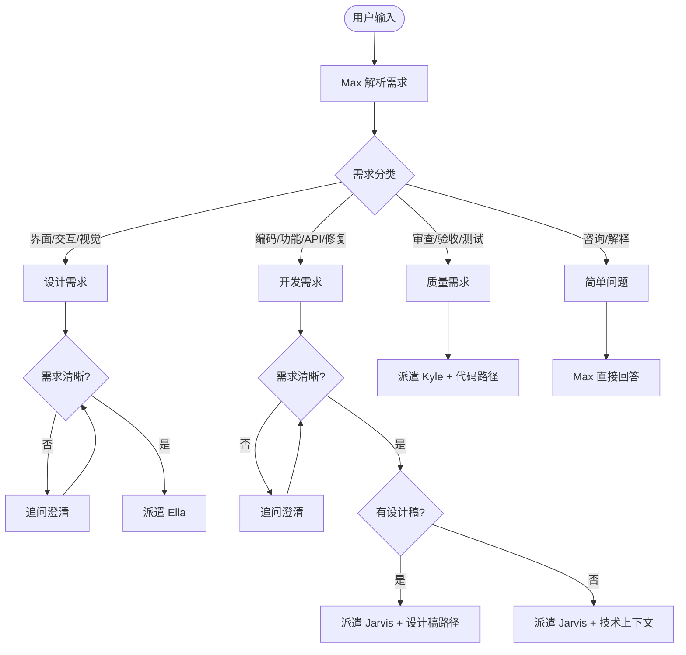
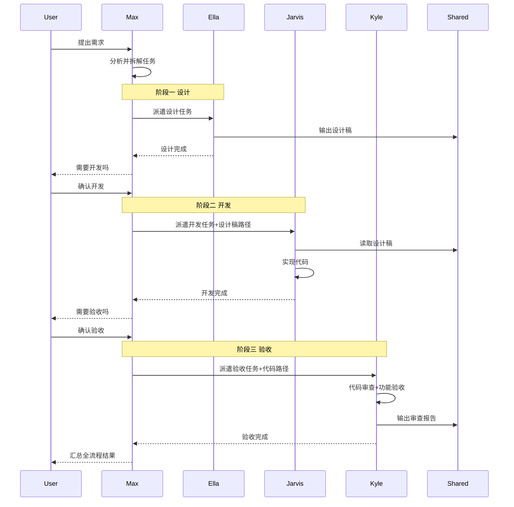
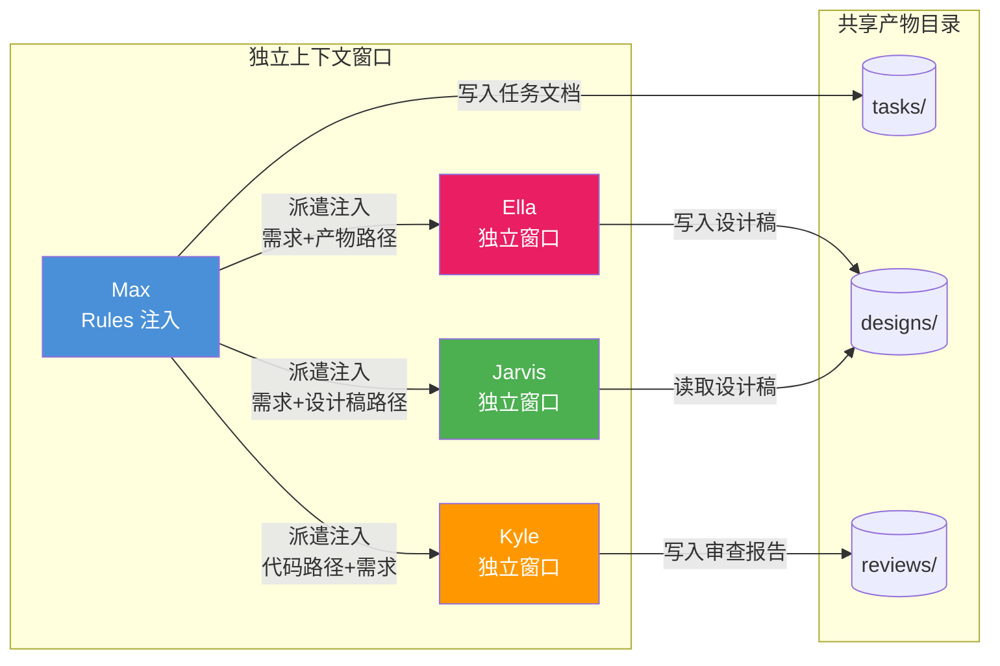
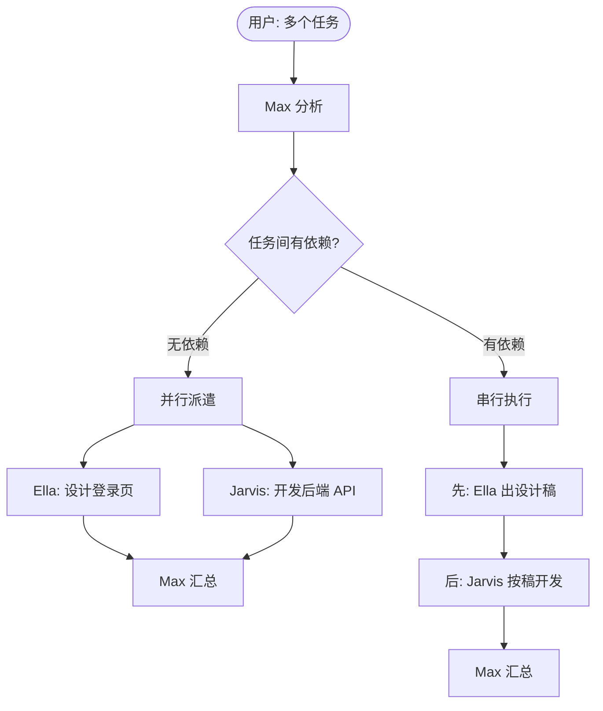
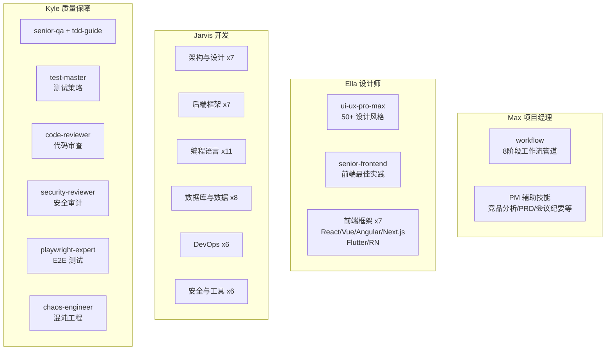

# aiGroup - AI 团队协作框架

> 单入口 AI 团队：一个命令启动，按需自动派遣设计、开发、测试专家。
> 内置门禁式工作流：需求澄清 → 方案设计 → 实现计划 → 子代理开发 → 两阶段审查 → 分支收尾。

## 快速开始

### 环境要求

| 依赖 | 最低版本 | 用途 |
|------|---------|------|
| [Claude Code](https://docs.anthropic.com/en/docs/claude-code) | 最新版 | AI Agent 运行时（主要使用方式） |
| [Cursor](https://cursor.com) | 最新版 | AI IDE（可选，替代使用方式） |
| Node.js | 18+ | CLI 工具运行 |
| Git | 2.x | 版本控制 |
| Bash | 4.x+ | Harness 传感器脚本（Windows 用户可用 Git Bash） |

### 安装

```bash
# 方式一：通过 npm 安装 CLI（推荐）
npm install -g aigroup-workflow
aigroup init

# 方式二：npx 免安装使用
npx aigroup-workflow init

# 方式三：克隆仓库
git clone https://github.com/codeApe-7/ai-agent-workflowGroup.git
cd ai-agent-workflowGroup
```

### CLI 命令

```bash
aigroup init          # 交互式初始化（选择角色、安装技能和配置）
aigroup update        # 增量更新（只更新技能和传感器，不覆盖自定义）
aigroup check         # 运行 Harness 健康检查
aigroup status        # 查看工作流状态
aigroup init --yes    # 跳过确认，使用默认配置
```

`init` 命令支持交互式多选：使用 **方向键** 移动光标，**空格** 切换选中角色，**回车** 确认。

### 启动

**Claude Code 中使用（推荐）：**

```bash
cd your-project
claude
```

启动后 Max 自动就位，读取 `CLAUDE.md` 作为入口，根据你的需求驱动整个团队。

**Cursor 中使用：**

直接用 Cursor 打开项目目录，Agent 会自动读取 `CLAUDE.md` 获取框架规则。

### 三种使用模式

**模式一：完整管道（复杂任务）**

直接描述需求，Max 自动驱动完整管道：

```
你: 帮我做一个用户认证系统
→ Max 启动 brainstorming，逐步澄清需求
→ Max 产出实现计划，用户确认
→ Max 派遣 Jarvis 逐任务开发，Kyle 两阶段审查
→ Max 收尾集成
```

**模式二：斜杠命令直接派遣（明确任务）**

跳过 Max 调度，直接派遣指定成员：

```
/ella 设计一个登录页面         # 直接派遣设计师
/jarvis 实现用户认证 API       # 直接派遣开发
/kyle 审查用户模块代码          # 直接派遣质量保障
```

**模式三：简单问答（轻量任务）**

不涉及设计决策的简单问题，Max 直接回答：

```
你: 这个项目用的什么技术栈？
→ Max 直接回答，不启动管道
```

判断标准：涉及 2 个以上文件或需要设计决策 → 走完整管道。

## 团队成员

| 成员             | 角色          | 负责什么                         | 不负责什么         |
|------------------|---------------|----------------------------------|--------------------|
| 麦克斯 (Max)     | 项目经理      | 需求分析、任务拆解、进度协调     | 写代码、做设计、做测试 |
| 艾拉 (Ella)      | UI/UX 设计师  | 界面设计、交互原型、设计规范     | 写代码、做测试     |
| 贾维斯 (Jarvis)  | 全栈开发      | 前后端编码、API、技术方案        | 做设计、做测试验收 |
| 凯尔 (Kyle)      | 质量保障      | 代码审查、功能验收、安全审计     | 写代码、做设计     |

## 工作流程

### 总体协作流程


### 任务派遣决策流程



### 完整流水线



### 上下文传递机制



> **关键规则**：子 Agent 之间不能直接通信，所有上下文由 Max 在派遣时注入，跨 Agent 协作通过 `.dev-agents/shared/` 目录下的文件实现。

### 并行与串行



## 工作流技能（门禁式管道）

受 [Superpowers](https://github.com/obra/superpowers) 和 [Harness Engineering](https://martinfowler.com/articles/harness-engineering.html) 启发，aiGroup 内置工作流技能，形成严格的门禁管道——每个环节必须完成才能进入下一步：

```
brainstorming → writing-plans → subagent-driven-development → finishing-a-development-branch
                                        ↑                              ↑
                              systematic-debugging            verification-before-completion
                              （遇 Bug 时触发）              （任何完成声明前触发）
                                                    ↑
                                          entropy-management
                                          （定期维护触发）
```

| 技能 | 触发时机 | 核心规则 |
|------|---------|---------|
| **brainstorming** | 任何创造性工作之前 | 一次一个问题、2-3 方案对比、用户批准后才能继续 |
| **writing-plans** | 有设计方案后、编码前 | 任务粒度 2-5 分钟、禁止占位符、每步有完整代码 |
| **subagent-driven-development** | 有计划后、开发执行 | 每任务新子代理、两阶段审查（先规格后质量） |
| **systematic-debugging** | 遇到 Bug/测试失败 | 四阶段根因分析、3 次失败后质疑架构 |
| **verification-before-completion** | 声称完成/通过之前 | 无验证证据不得声明完成 |
| **finishing-a-development-branch** | 所有任务完成后 | 全量测试 → 四选一集成方式 → 清理 |
| **entropy-management** | 定期维护/漂移信号 | 传感器扫描 → 推理检查 → 修复 → 更新质量评分 |

### 两阶段审查

每次 Jarvis 完成开发后，Kyle 按严格顺序执行：

1. **Stage 1：规格符合性** — 多了什么？少了什么？偏离了什么？
2. **Stage 2：代码质量** — 干净、安全、可维护？

Stage 1 不通过 → 修复 → 重审 Stage 1 → 通过后才进入 Stage 2

### 三条铁律

```
1. 证据优于断言 — 任何完成声明必须附带验证证据
2. 流程不可跳过 — 工作流管道的每个环节必须走完
3. 不确定时先问 — 宁可多问一句，不要假设
```

## 使用示例

### 示例 1：完整功能开发

```
你: 帮我做一个用户认证系统

Max: [启动 brainstorming] → 逐个提问澄清需求 → 展示设计方案 → 用户批准
Max: [启动 writing-plans] → 产出分步实现计划 → 用户确认
Max: [启动 subagent-driven-development]
  → 派遣 Jarvis 执行任务 1 → Kyle Stage 1 审查 → Kyle Stage 2 审查
  → 派遣 Jarvis 执行任务 2 → Kyle Stage 1 审查 → Kyle Stage 2 审查
  → ...
Max: [启动 finishing-a-development-branch] → 全量测试 → 用户选择集成方式
```

### 示例 2：直接派遣设计

```
/ella 设计一个电商首页，风格参考 Apple Store，需要有 hero banner、商品分类、推荐列表

→ Ella 读取 PERSONA 和 ui-ux-pro-max 技能
→ 产出设计稿到 .dev-agents/shared/designs/ecommerce-home.md
→ 返回：设计稿路径 + 设计决策摘要 + 实现注意事项
```

### 示例 3：代码审查

```
/kyle 审查 src/auth/ 目录下的认证模块代码，对照实现计划 .dev-agents/shared/tasks/auth-plan.md

→ Kyle 读取实现计划和代码
→ Stage 1：逐条检查规格符合性
→ Stage 2：检查代码质量、安全性、可维护性
→ 产出审查报告到 .dev-agents/shared/reviews/auth-review.md
```

### 示例 4：Bug 调试

```
你: 用户登录后 token 刷新失败，返回 401

→ Max 检测到 Bug 信号，启动 systematic-debugging
→ 派遣 Jarvis 执行四阶段根因调查
→ 第一阶段：阅读错误信息、稳定复现
→ 第二阶段：找到可工作示例，对照差异
→ 第三阶段：假设验证（一次一个变量）
→ 第四阶段：创建失败测试 → 修复 → 验证
```

### 示例 5：Harness 健康检查

```
你: 跑一下项目健康检查

→ Max 启动 entropy-management 技能
→ 第一阶段：运行 scripts/harness/run-all.sh 自动化扫描
→ 第二阶段：推理型扫描（文档一致性、架构漂移）
→ 第三阶段：修复问题 + 将重复问题编码为约束
→ 第四阶段：更新 docs/QUALITY_SCORE.md 和 docs/tech-debt-tracker.md
```

## 集成到已有项目

aiGroup 可以作为"脚手架"集成到你的任何项目中。

### 方式一：CLI 工具（推荐）

```bash
cd your-project
npx aigroup-workflow init
```

交互式选择需要的角色，自动安装所有框架文件。

### 方式二：手动复制

将以下目录和文件复制到你的项目根目录：

```bash
# 必须复制
CLAUDE.md                    # Agent 入口
docs/                        # 知识库
.claude/                     # Claude Code 配置（commands/ + hooks.json + settings.json）
.dev-agents/                 # 角色定义 + 协作产物目录
scripts/harness/             # Harness 传感器

# 按需复制
skills/max/workflow/         # 工作流技能（强烈推荐）
skills/ella/                 # 设计技能（如果需要 UI 设计）
skills/jarvis/               # 开发技能（如果需要工程技能集）
skills/kyle/                 # QA 技能（如果需要质量保障）
```

### 适配你的项目

1. **编辑 `CLAUDE.md`**：不需要大改，只需确认知识库地图路径正确
2. **编辑 `docs/ARCHITECTURE.md`**：替换为你项目的架构描述
3. **编辑 `docs/coding-standards.md`**：替换为你项目的编码规范
4. **编辑 `.dev-agents/*/PERSONA.md`**：根据需要调整角色定义

### 验证安装

```bash
aigroup check
# 或
bash scripts/harness/run-all.sh
```

所有检查通过即可开始使用。

## 常用命令速查

### 日常使用

| 命令 | 说明 | 使用场景 |
|------|------|---------|
| `claude` | 启动 Claude Code + Max | 开始工作 |
| `/ella <任务>` | 直接派遣设计师 | 界面设计、交互原型 |
| `/jarvis <任务>` | 直接派遣开发 | 编码、技术方案、Bug 修复 |
| `/kyle <任务>` | 直接派遣质量保障 | 代码审查、功能验收 |

### CLI 工具

| 命令 | 说明 |
|------|------|
| `aigroup init` | 交互式初始化框架 |
| `aigroup init --yes` | 使用默认配置初始化 |
| `aigroup update` | 增量更新技能和传感器 |
| `aigroup check` | 运行 Harness 健康检查 |
| `aigroup status` | 查看工作流状态 |

### Harness 维护

| 命令 | 说明 | 建议频率 |
|------|------|---------|
| `bash scripts/harness/run-all.sh` | 全量 Harness 传感器检查 | 每次开发完成后 |
| `bash scripts/check-gitignore.sh` | 检查 .gitignore 规则 | 添加新文件类型时 |
| `bash scripts/clean-system-files.sh` | 清理 .DS_Store 等系统文件 | 偶尔运行 |

> Windows 用户：用 Git Bash 运行以上命令（`"D:\Git\bin\bash.exe" scripts/harness/run-all.sh`）。

### 自定义与扩展

| 想要做 | 修改什么 |
|--------|---------|
| 调整 Agent 角色定义 | `.dev-agents/{name}/PERSONA.md` |
| 修改工作流规则 | `skills/max/workflow/{skill}/SKILL.md` |
| 添加新的编码规范 | `docs/coding-standards.md` |
| 添加新的传感器检查 | `scripts/harness/lint-*.sh` 中添加检查项 |
| 添加新的危险信号 | `docs/red-flags.md` 中添加条目 |
| 将重复问题编码为约束 | 遵循 `docs/steering-loop.md` 转向循环流程 |
| 添加新的 Hook | `.claude/hooks.json` 中添加事件 |
| 修改权限控制 | `.claude/settings.json` 中调整 allow/deny |
| 添加新团队成员 | 新建 `.dev-agents/{name}/PERSONA.md` + `.claude/commands/{name}.md` |

## 项目结构

```
aiGroup/
├── CLAUDE.md                  # Agent 入口：全局地图
├── package.json               # npm 包配置
├── bin/aigroup.mjs            # CLI 入口
├── cli/                       # CLI 实现
│   ├── commands/              #   init / update / check / status
│   └── utils/                 #   prompts / logger / scaffold
├── docs/                      # 知识库（唯一事实源）
│   ├── ARCHITECTURE.md        #   项目架构总览
│   ├── workflow-pipeline.md   #   工作流管道详细规则
│   ├── dispatch-rules.md      #   派遣规则与上下文传递
│   ├── coding-standards.md    #   编码与 Git 规范
│   ├── red-flags.md           #   危险信号检测
│   ├── QUALITY_SCORE.md       #   质量评分追踪
│   ├── tech-debt-tracker.md   #   技术债追踪
│   └── steering-loop.md       #   Harness 转向循环
├── .claude/                   # Claude Code 原生配置
│   ├── settings.json          #   项目级权限设置
│   ├── hooks.json             #   Harness 生命周期 Hooks
│   └── commands/              #   斜杠命令（/ella /jarvis /kyle）
├── .dev-agents/               # 角色定义 + 协作产物
│   ├── ella/PERSONA.md
│   ├── jarvis/PERSONA.md
│   ├── kyle/PERSONA.md
│   └── shared/                #   协作产物（tasks/ designs/ reviews/ templates/）
├── skills/                    # 技能资源（按角色分组）
│   ├── max/                   #   PM 技能
│   │   ├── workflow/          #     8 阶段工作流管道 + 横切技能（11 个）
│   │   ├── competitive-analysis/  # 竞品分析
│   │   ├── meeting-notes/         # 会议纪要
│   │   ├── prd-template/          # PRD 撰写
│   │   ├── stakeholder-update/    # 干系人汇报
│   │   └── user-research-synthesis/ # 用户研究综合
│   ├── ella/                  #   设计技能（10 个）
│   │   ├── ui-ux-pro-max/     #     50+ 设计风格、97 色彩方案
│   │   ├── senior-frontend/   #     前端最佳实践
│   │   ├── react-expert/      #     React 组件与 Hooks
│   │   ├── nextjs-developer/  #     Next.js SSR/SSG
│   │   ├── vue-expert/        #     Vue 3 (TypeScript)
│   │   ├── vue-expert-js/     #     Vue 3 (JavaScript)
│   │   ├── angular-architect/ #     Angular 企业级架构
│   │   ├── react-native-expert/ #   React Native 移动端
│   │   ├── flutter-expert/    #     Flutter 跨平台
│   │   └── commands/          #     设计工具命令
│   ├── jarvis/                #   开发技能（45 个）
│   │   ├── architecture-designer/  # 系统架构设计
│   │   ├── api-designer/           # API 设计
│   │   ├── fullstack-guardian/     # 全栈安全开发
│   │   ├── microservices-architect/ # 微服务架构
│   │   ├── secure-code-guardian/   # 安全编码
│   │   ├── debugging-wizard/       # 系统化调试
│   │   ├── typescript-pro/         # TypeScript 专家
│   │   ├── python-pro/             # Python 专家
│   │   ├── golang-pro/             # Go 专家
│   │   └── ...                     # 更多语言/框架/DevOps 技能
│   └── kyle/                  #   QA 技能（7 个）
│       ├── senior-qa/         #     QA 最佳实践
│       ├── tdd-guide/         #     TDD 指南
│       ├── test-master/       #     测试策略
│       ├── code-reviewer/     #     代码审查
│       ├── security-reviewer/ #     安全审计
│       ├── playwright-expert/ #     E2E 测试
│       └── chaos-engineer/    #     混沌工程
├── scripts/                   # 自动化脚本
│   ├── harness/               #   Harness 传感器套件
│   │   ├── run-all.sh         #     全量传感器运行器
│   │   ├── lint-structure.sh  #     结构检查
│   │   ├── lint-docs.sh       #     文档新鲜度检查
│   │   ├── lint-workflow-artifacts.sh  # 工作流产物检查
│   │   ├── hook-post-edit.sh  #     PostToolUse Hook
│   │   ├── hook-stop.sh       #     Stop Hook（back-pressure）
│   │   └── hook-subagent-stop.sh  #  SubagentStop Hook
│   ├── check-gitignore.sh     #   .gitignore 规则检查
│   └── clean-system-files.sh  #   系统文件清理
└── README.md
```

## 技能体系

### 技能与角色对应



### 技能分布总览

| 角色 | 技能数 | 核心领域 |
|------|--------|---------|
| **Max** (PM) | 16 | 8 阶段工作流管道 + 3 横切技能 + 5 PM 辅助技能 |
| **Ella** (设计) | 10 | UI/UX 设计 + 前端最佳实践 + 7 前端框架 |
| **Jarvis** (开发) | 45 | 架构设计、后端框架、编程语言、数据库、DevOps、安全编码 |
| **Kyle** (QA) | 7 | QA 实践、TDD、测试策略、代码审查、安全审计、E2E、混沌工程 |

## 技能来源

| 技能 | 来源 | 许可证 |
|------|------|--------|
| 工作流技能 (11个) | 原创，受 [obra/superpowers](https://github.com/obra/superpowers) 和 [Harness Engineering](https://martinfowler.com/articles/harness-engineering.html) 启发 | MIT |
| Jarvis/Kyle/Ella 开发技能 (62个) | [Jeffallan/claude-skills](https://github.com/Jeffallan/claude-skills) | MIT |
| PM 辅助技能 (5个) | [mohitagw15856/pm-claude-skills](https://github.com/mohitagw15856/pm-claude-skills) | MIT |
| UI/UX Pro Max | SkillsMP 技能市场 | MIT |
| Senior Frontend / QA / TDD | SkillsMP 技能市场 | MIT |

## Harness Engineering 体系

aiGroup 采用 [Harness Engineering](https://martinfowler.com/articles/harness-engineering.html) 理念，通过约束、反馈回路和持续改进循环提升 Agent 可靠性。

### 核心公式

```
Agent = Model + Harness
```

不优化模型本身，而是优化模型运行的环境。

### 四层防线

| 层级 | 机制 | 实现 |
|------|------|------|
| **前馈引导** | 在 Agent 行动前引导方向 | CLAUDE.md 地图、Skills 渐进披露、工作流管道 |
| **计算型反馈** | 确定性检查，快速自动运行 | `scripts/harness/` 传感器套件 + Claude Code Hooks |
| **推理型反馈** | AI 语义审查 | Kyle 两阶段审查（规格符合性 + 代码质量） |
| **熵管理** | 防止长期退化 | entropy-management 技能 + 质量评分追踪 |

### Harness 传感器

```bash
bash scripts/harness/run-all.sh   # 全量检查
```

传感器输出对 Agent 友好：`[PASS]` 通过、`[FAIL]` 失败 + `[FIX]` 修复指令。

### 转向循环

```
发现重复问题 → 编码为约束（Linter/文档/技能）→ 自动执行 → 更新质量评分
```

详见 `docs/steering-loop.md`。

### 知识库

所有规范、架构决策、质量追踪均版本化存储在 `docs/` 目录下，作为项目的唯一事实源。
CLAUDE.md 仅作为地图入口（< 100 行），详细内容按需从 `docs/` 检索。

## 致谢

本项目基于 [yezannnnn/agentGroup](https://github.com/yezannnnn/agentGroup) 进行开发和扩展。感谢原作者 [@yezannnnn](https://github.com/yezannnnn) 提出的四 AI 专业分工协作框架理念，为本项目奠定了坚实的基础。

## 社区支持

<div align="center">

**学 AI，上 L 站**

[](https://linux.do/) [](https://linux.do/)

本项目在 [LINUX DO](https://linux.do/) 社区发布与交流，感谢佬友们的支持与反馈。

</div>

## 许可证

MIT License
