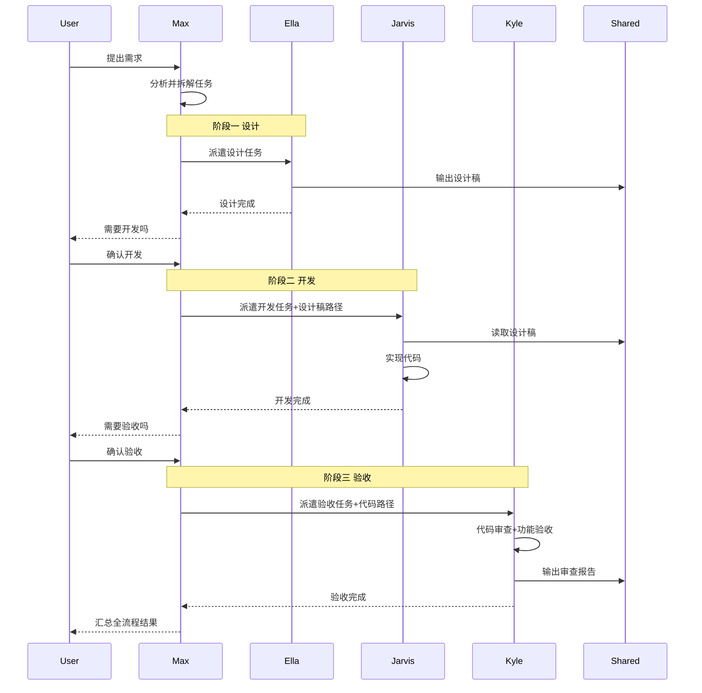
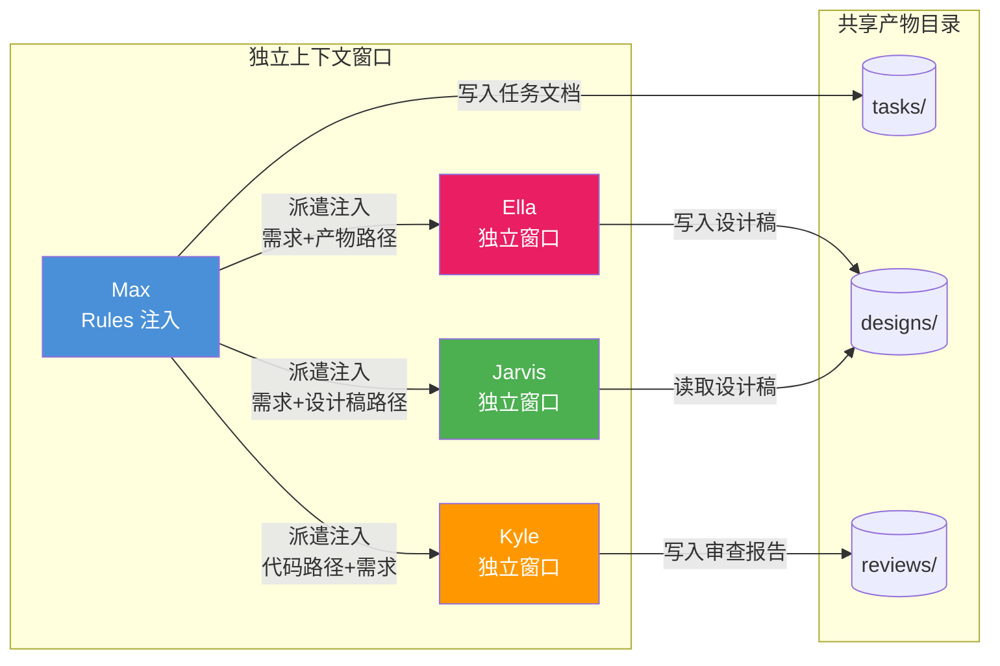
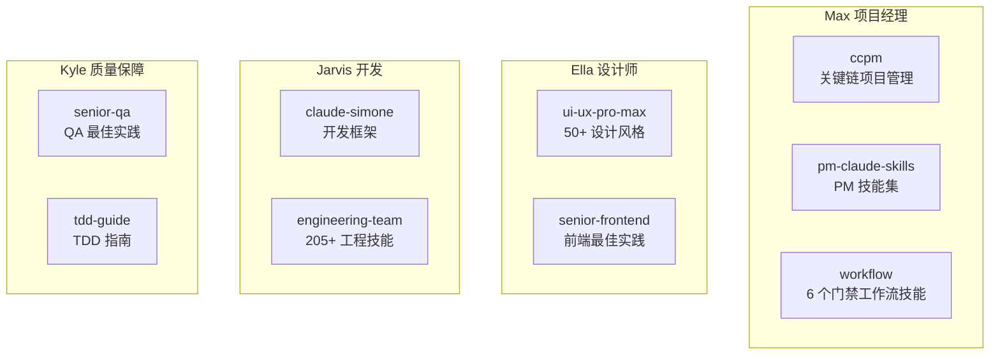

# aiGroup - AI 团队协作框架

> 单入口 AI 团队：一个命令启动，按需自动派遣设计、开发、测试专家。
> 内置门禁式工作流：需求澄清 → 方案设计 → 实现计划 → 子代理开发 → 两阶段审查 → 分支收尾。

## 快速开始

```bash
git clone https://github.com/yezannnnn/agentGroup.git
cd agentGroup
claude
```

就这样。麦克斯 (Max) 会自动就位，根据你的需求派遣对应的团队成员。

也可以通过斜杠命令直接派遣团队成员：

```
/ella 设计一个登录页面         # 直接派遣设计师
/jarvis 实现用户认证 API       # 直接派遣开发
/kyle 审查用户模块代码          # 直接派遣质量保障
```

## 团队成员

| 成员             | 角色          | 负责什么                         | 不负责什么         |
|------------------|---------------|----------------------------------|--------------------|
| 麦克斯 (Max)     | 项目经理      | 需求分析、任务拆解、进度协调     | 写代码、做设计、做测试 |
| 艾拉 (Ella)      | UI/UX 设计师  | 界面设计、交互原型、设计规范     | 写代码、做测试     |
| 贾维斯 (Jarvis)  | 全栈开发      | 前后端编码、API、技术方案        | 做设计、做测试验收 |
| 凯尔 (Kyle)      | 质量保障      | 代码审查、功能验收、安全审计     | 写代码、做设计     |

## 工作流程

### 总体协作流程


### 任务派遣决策流程


### 完整流水线



### 上下文传递机制



> **关键规则**：子 Agent 之间不能直接通信，所有上下文由 Max 在派遣时注入，跨 Agent 协作通过 `.dev-agents/shared/` 目录下的文件实现。

### 并行与串行


## 工作流技能（门禁式管道）

受 [Superpowers](https://github.com/obra/superpowers) 启发，aiGroup 内置 6 个工作流技能，形成严格的门禁管道——每个环节必须完成才能进入下一步：

```
brainstorming → writing-plans → subagent-driven-development → finishing-a-development-branch
                                        ↑                              ↑
                              systematic-debugging            verification-before-completion
                              （遇 Bug 时触发）              （任何完成声明前触发）
```

| 技能 | 触发时机 | 核心规则 |
|------|---------|---------|
| **brainstorming** | 任何创造性工作之前 | 一次一个问题、2-3 方案对比、用户批准后才能继续 |
| **writing-plans** | 有设计方案后、编码前 | 任务粒度 2-5 分钟、禁止占位符、每步有完整代码 |
| **subagent-driven-development** | 有计划后、开发执行 | 每任务新子代理、两阶段审查（先规格后质量） |
| **systematic-debugging** | 遇到 Bug/测试失败 | 四阶段根因分析、3 次失败后质疑架构 |
| **verification-before-completion** | 声称完成/通过之前 | 无验证证据不得声明完成 |
| **finishing-a-development-branch** | 所有任务完成后 | 全量测试 → 四选一集成方式 → 清理 |

### 两阶段审查

每次 Jarvis 完成开发后，Kyle 按严格顺序执行：

1. **Stage 1：规格符合性** — 多了什么？少了什么？偏离了什么？
2. **Stage 2：代码质量** — 干净、安全、可维护？

Stage 1 不通过 → 修复 → 重审 Stage 1 → 通过后才进入 Stage 2

### 三条铁律

```
1. 证据优于断言 — 任何完成声明必须附带验证证据
2. 流程不可跳过 — 工作流管道的每个环节必须走完
3. 不确定时先问 — 宁可多问一句，不要假设
```

## 使用示例

```
你: 帮我做一个用户认证系统

Max: [启动 brainstorming] → 逐个提问澄清需求 → 展示设计方案 → 用户批准
Max: [启动 writing-plans] → 产出分步实现计划 → 用户确认
Max: [启动 subagent-driven-development]
  → 派遣 Jarvis 执行任务 1 → Kyle Stage 1 审查 → Kyle Stage 2 审查
  → 派遣 Jarvis 执行任务 2 → Kyle Stage 1 审查 → Kyle Stage 2 审查
  → ...
Max: [启动 finishing-a-development-branch] → 全量测试 → 用户选择集成方式
```

## 项目结构

```
agentGroup/
├── CLAUDE.md                  # Max 配置 + 调度规则（唯一入口）
├── .claude/                   # Claude Code 原生配置
│   ├── settings.json          #   项目级权限设置
│   └── commands/              #   斜杠命令
│       ├── ella.md            #     /ella 派遣设计师
│       ├── jarvis.md          #     /jarvis 派遣开发
│       └── kyle.md            #     /kyle 派遣质量保障
├── .dev-agents/               # 角色定义 + 协作产物
│   ├── ella/PERSONA.md        # 艾拉角色定义
│   ├── jarvis/PERSONA.md      # 贾维斯角色定义
│   ├── kyle/PERSONA.md        # 凯尔角色定义
│   └── shared/                # 协作产物
│       ├── tasks/             #   实现计划（writing-plans 产出）
│       ├── designs/           #   设计方案和设计稿
│       ├── reviews/           #   审查报告
│       └── templates/         #   文档模板（PRD/API/Bug/实现计划/审查报告）
├── skills/                    # 技能资源（按角色分组）
│   ├── ella/                  # 设计技能
│   │   ├── ui-ux-pro-max/     #   50+ 设计风格、97 色彩方案
│   │   ├── senior-frontend/   #   前端最佳实践
│   │   └── commands/          #   设计工具命令
│   ├── jarvis/                # 开发技能
│   │   ├── claude-simone/     #   开发框架方法论
│   │   └── engineering-team/  #   205+ 工程技能集（见下表）
│   ├── kyle/                  # 测试技能
│   │   ├── senior-qa/         #   QA 最佳实践
│   │   └── tdd-guide/         #   TDD 指南
│   └── max/                   # 管理技能
│       ├── ccpm/              #   关键链项目管理
│       ├── pm-claude-skills/  #   PM 技能集
│       └── workflow/          #   工作流技能（6 个门禁技能）
│           ├── brainstorming/
│           ├── writing-plans/
│           ├── subagent-driven-development/
│           ├── systematic-debugging/
│           ├── verification-before-completion/
│           └── finishing-a-development-branch/
├── scripts/                   # 自动化脚本
│   ├── update-skills.sh       #   技能更新（支持镜像加速）
│   ├── check-gitignore.sh     #   .gitignore 规则检查
│   └── clean-system-files.sh  #   系统文件清理
└── README.md
```

## 技能体系

### 技能与角色对应



### Engineering Team 技能清单（205+ 技能）

更新 engineering-team 后，贾维斯获得了 9 大领域的技能支持：

| 领域               | 技能数 | 核心技能                                                       |
|--------------------|--------|----------------------------------------------------------------|
| 核心工程           | 29     | senior-architect, senior-fullstack, senior-frontend, senior-backend, senior-devops, code-reviewer, tdd-guide, a11y-audit, playwright-pro, epic-design |
| 高级工程 (POWERFUL) | 30     | agent-designer, rag-architect, mcp-server-builder, ci-cd-pipeline-builder, database-designer, observability-designer |
| 产品团队           | 13     | RICE 评分, OKR 规划, 用户故事, SaaS 脚手架, 落地页生成器       |
| 营销技能           | 43     | 内容创作, SEO, ASO, 需求生成, 品牌声音, 竞品分析               |
| 项目管理           | 6      | Jira/Confluence 集成, CCPM, Sprint 规划                        |
| C-Level 顾问       | 28     | CEO/CTO 战略决策, 组织架构, OKR 战略                           |
| 合规质量 (RA/QM)   | 12     | ISO 13485, FDA, GDPR, ISO 27001                               |
| 商业增长           | 4      | 客户成功, 销售工程, 收入运营                                   |
| 财务分析           | 2      | DCF 估值, SaaS 指标, 预算编制                                  |

附带 **268 个 Python 自动化工具** 和 **384 份参考指南**。

## 技能来源与更新

| 技能              | 来源                                                                                 | 许可证   | 更新方式 |
|-------------------|--------------------------------------------------------------------------------------|----------|----------|
| 工作流技能 (6个)  | 原创，受 [obra/superpowers](https://github.com/obra/superpowers) 启发                | MIT      | 内置     |
| CCPM 项目管理     | [automazeio/ccpm](https://github.com/automazeio/ccpm)                               | MIT      | 脚本自动 |
| PM Claude Skills  | [mohitagw15856/pm-claude-skills](https://github.com/mohitagw15856/pm-claude-skills)  | MIT      | 脚本自动 |
| Claude Simone     | [Helmi/claude-simone](https://github.com/Helmi/claude-simone)                        | 见原仓库 | 脚本自动 |
| Engineering Team  | [alirezarezvani/claude-skills](https://github.com/alirezarezvani/claude-skills)      | 见原仓库 | 脚本自动 |
| UI/UX Pro Max     | SkillsMP 技能市场                                                                    | MIT      | 手动下载 |
| Senior Frontend   | SkillsMP 技能市场                                                                    | MIT      | 手动下载 |
| Senior QA / TDD   | SkillsMP 技能市场                                                                    | MIT      | 手动下载 |

### 更新 Skills

```bash
bash scripts/update-skills.sh all          # 更新所有 GitHub 来源
bash scripts/update-skills.sh ccpm         # 只更新 CCPM
bash scripts/update-skills.sh pm           # 只更新 PM Skills
bash scripts/update-skills.sh simone       # 只更新 Claude Simone
bash scripts/update-skills.sh engineering  # 只更新 Engineering Team
bash scripts/update-skills.sh manual       # 显示需手动更新的技能
```

> 直连 GitHub 失败时脚本自动切换镜像加速（ghfast.top / ghproxy）。

## 许可证

MIT License
