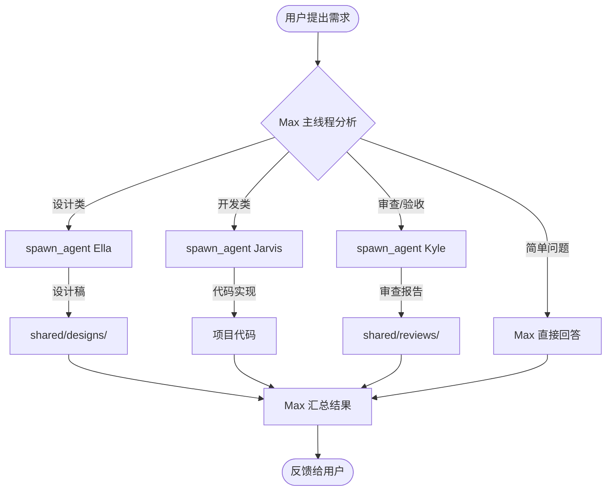
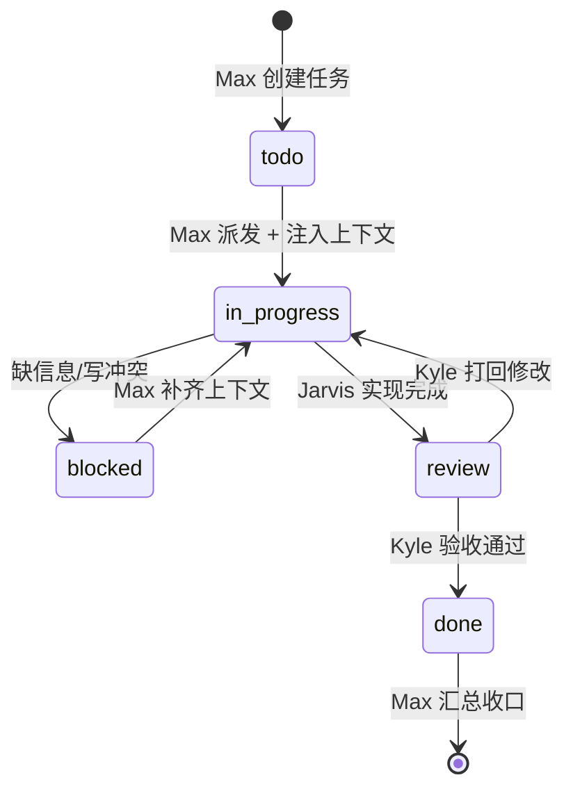
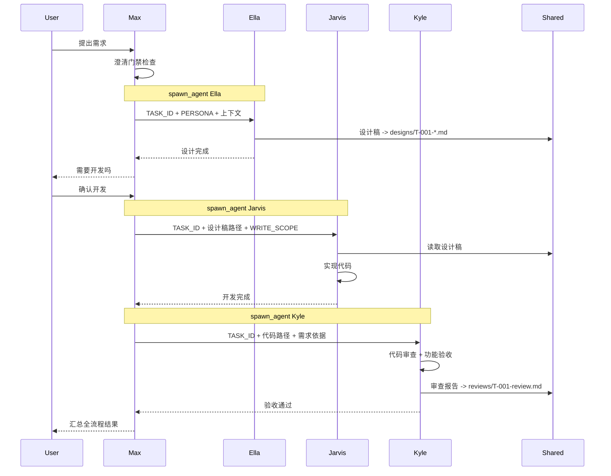
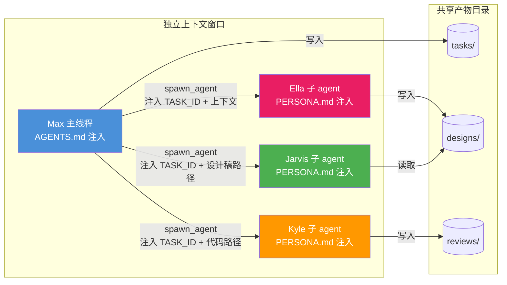
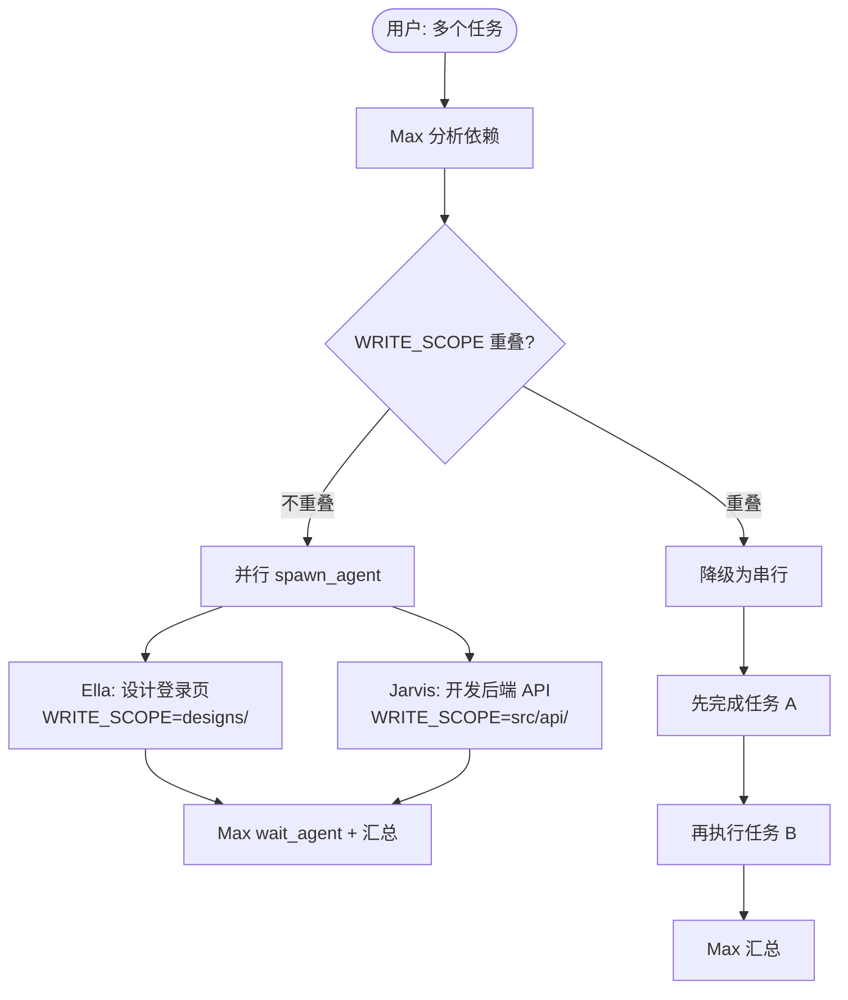
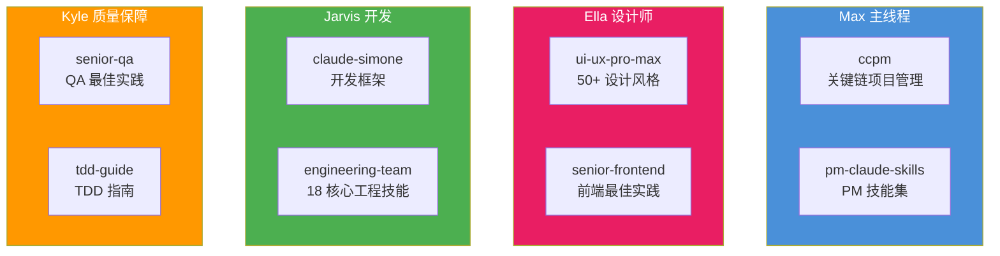

# agentGroup - 角色化多 Agent 协作框架（Codex）

> 主线程扮演 Max，子 agent 分别扮演 Ella、Jarvis、Kyle，按角色协作完成设计、开发、验收闭环。

## 核心变化

这个仓库采用单入口协议：

- `AGENTS.md`：同时定义主线程角色（Max）与子角色派发规则
- `.dev-agents/*/PERSONA.md`：定义每个子角色的执行规范

## 架构角色

| 人物角色         | 在 Codex 中的形态 | 负责内容                         | 典型产物                              |
|------------------|-------------------|----------------------------------|---------------------------------------|
| Max（主线程）    | 当前会话          | 需求分析、任务拆解、调度和汇总   | 任务计划、最终结论                    |
| Ella             | 子 agent          | UI/UX 设计与交互方案             | `.dev-agents/shared/designs/*.md`     |
| Jarvis           | 子 agent          | 前后端实现和问题修复             | 代码改动与验证结果                    |
| Kyle             | 子 agent          | 审查、验收、安全检查             | `.dev-agents/shared/reviews/*.md`     |

## 协作流程图

### 总体协作流程



### 任务状态机



### 完整流水线



### 上下文传递与隔离



> **关键规则**：子 agent 之间不直接通信，统一由 Max 通过 `spawn_agent` + `send_input` 传递上下文。

### 并行与冲突控制



## Codex 协作原则

1. 主线程始终是 Max，不切换为子角色。
2. 每个子 agent 只扮演一个人物角色，不混角。
3. 子 agent 之间不直接通信，统一由 Max 传递上下文。
4. 并行开发前必须声明 `WRITE_SCOPE`，避免冲突。
5. 设计、开发、验收尽量形成闭环，不跳过 Kyle 验收。
6. 需求不清时，Max 必须先澄清再派发，不能跳过澄清门禁。

## 目录结构

```text
agentGroup/
├── AGENTS.md                     # Max 主角色 + Codex 角色派发协议
├── .dev-agents/
│   ├── ella/PERSONA.md           # Ella 角色规范
│   ├── jarvis/PERSONA.md         # Jarvis 角色规范
│   ├── kyle/PERSONA.md           # Kyle 角色规范
│   └── shared/                   # 协作产物
│       ├── tasks/                #   任务单（T-001-*.md）
│       ├── designs/              #   设计输出（T-001-*.md）
│       ├── reviews/              #   审查报告（T-001-review.md）
│       └── templates/            #   结构化模板（PRD/API/Bug 等）
├── skills/                       # 技能资源（按角色分组）
│   ├── ella/                     # 设计技能
│   │   ├── ui-ux-pro-max/        #   50+ 设计风格、97 色彩方案
│   │   ├── senior-frontend/      #   前端最佳实践
│   │   └── commands/             #   设计工具命令
│   ├── jarvis/                   # 开发技能
│   │   ├── claude-simone/        #   开发框架方法论
│   │   └── engineering-team/     #   18 核心工程技能 + 扩展领域
│   ├── kyle/                     # 测试技能
│   │   ├── senior-qa/            #   QA 最佳实践
│   │   └── tdd-guide/            #   TDD 指南
│   └── max/                      # 管理技能
│       ├── ccpm/                 #   关键链项目管理
│       └── pm-claude-skills/     #   PM 技能集
├── scripts/                      # 自动化脚本
│   ├── update-skills.sh          #   技能更新（支持镜像加速）
│   ├── check-gitignore.sh        #   .gitignore 规则检查
│   └── clean-system-files.sh     #   系统文件清理
└── README.md
```

## 角色与技能映射



| 角色   | 默认技能来源                                                                           | 用途                             |
|--------|----------------------------------------------------------------------------------------|----------------------------------|
| Ella   | `skills/ella/ui-ux-pro-max/`, `skills/ella/senior-frontend/`                          | 设计规范、交互方案、前端实现参考 |
| Jarvis | `skills/jarvis/claude-simone/`, `skills/jarvis/engineering-team/`                      | 开发框架、架构与工程实践         |
| Kyle   | `skills/kyle/senior-qa/`, `skills/kyle/tdd-guide/`                                    | 测试策略、验收与质量分析         |
| Max    | `skills/max/ccpm/`, `skills/max/pm-claude-skills/`                                    | 需求整理、任务拆解、协作管理     |

### Engineering Team 技能详情

Jarvis 的 `engineering-team/` 包含 18 个核心工程技能和 30+ Python 自动化工具：

**核心工程（13 个）：**

| 技能               | 用途                                    |
|--------------------|-----------------------------------------|
| senior-architect   | 系统架构设计、架构图生成、依赖分析      |
| senior-frontend    | React/Next.js 优化、组件架构            |
| senior-backend     | API 设计、数据库模式、后端最佳实践      |
| senior-fullstack   | 全栈脚手架、代码质量分析                |
| senior-qa          | 测试策略、自动化测试                    |
| senior-devops      | CI/CD 流水线、部署编排                  |
| senior-secops      | 安全运维、合规检查                      |
| senior-security    | 威胁建模、安全架构                      |
| code-reviewer      | 代码审查框架                            |
| aws-solution-architect | AWS 架构设计                        |
| ms365-tenant-manager   | Microsoft 365 管理                  |
| tdd-guide          | 测试驱动开发指南                        |
| tech-stack-evaluator   | 技术选型评估框架                    |

**AI/ML/Data（5 个）：**

| 技能                  | 用途                                    |
|-----------------------|-----------------------------------------|
| senior-data-scientist | 实验设计、特征工程、统计分析            |
| senior-data-engineer  | 数据管道、ETL、数据质量校验             |
| senior-ml-engineer    | 模型部署、MLOps、LLM 集成              |
| senior-prompt-engineer| Prompt 优化、RAG 系统、Agent 编排       |
| senior-computer-vision| 视觉模型训练、推理优化                  |

> **扩展领域**：上游仓库 ([alirezarezvani/claude-skills](https://github.com/alirezarezvani/claude-skills)) 还包含产品、营销、合规、财务等 200+ 扩展技能，均随更新脚本同步到本地，可按需引用。

## 任务命名规范

统一使用任务 ID 串联设计、开发、验收：

- 任务：`.dev-agents/shared/tasks/T-001-<slug>.md`
- 设计：`.dev-agents/shared/designs/T-001-<slug>.md`
- 审查：`.dev-agents/shared/reviews/T-001-review.md`

## 推荐用法

1. 在 Codex 中打开仓库。
2. 让主线程先读取 `AGENTS.md`，确认 Max 角色与派发规则。
3. 用自然语言提出需求，例如：

```text
把登录流程拆成 UI、接口、测试三个并行子任务来做
```

4. 主线程会按 `AGENTS.md` 中的规则判断是否需要派生 Ella、Jarvis、Kyle 对应的子 agent。

## 技能来源与更新

| 技能              | 来源                                                                                 | 许可证   | 更新方式 |
|-------------------|--------------------------------------------------------------------------------------|----------|----------|
| CCPM 项目管理     | [automazeio/ccpm](https://github.com/automazeio/ccpm)                               | MIT      | 脚本自动 |
| PM Claude Skills  | [mohitagw15856/pm-claude-skills](https://github.com/mohitagw15856/pm-claude-skills)  | MIT      | 脚本自动 |
| Claude Simone     | [Helmi/claude-simone](https://github.com/Helmi/claude-simone)                        | 见原仓库 | 脚本自动 |
| Engineering Team  | [alirezarezvani/claude-skills](https://github.com/alirezarezvani/claude-skills)      | 见原仓库 | 脚本自动 |
| UI/UX Pro Max     | SkillsMP 技能市场                                                                    | MIT      | 手动下载 |
| Senior Frontend   | SkillsMP 技能市场                                                                    | MIT      | 手动下载 |
| Senior QA / TDD   | SkillsMP 技能市场                                                                    | MIT      | 手动下载 |

### 更新 Skills

```bash
bash scripts/update-skills.sh all          # 更新所有 GitHub 来源
bash scripts/update-skills.sh ccpm         # 只更新 CCPM
bash scripts/update-skills.sh pm           # 只更新 PM Skills
bash scripts/update-skills.sh simone       # 只更新 Claude Simone
bash scripts/update-skills.sh engineering  # 只更新 Engineering Team
bash scripts/update-skills.sh manual       # 显示需手动更新的技能
```

> 直连 GitHub 失败时脚本自动切换镜像加速（ghfast.top / ghproxy）。

## 兼容说明

- `skills/` 下资料可继续复用；其中历史术语内容仅作为参考，不影响当前角色化主流程。
- 如需进一步统一，可把 `skills/max` 与 `skills/jarvis` 的术语逐步映射到 Codex 工具语义。

## 许可证

MIT License
